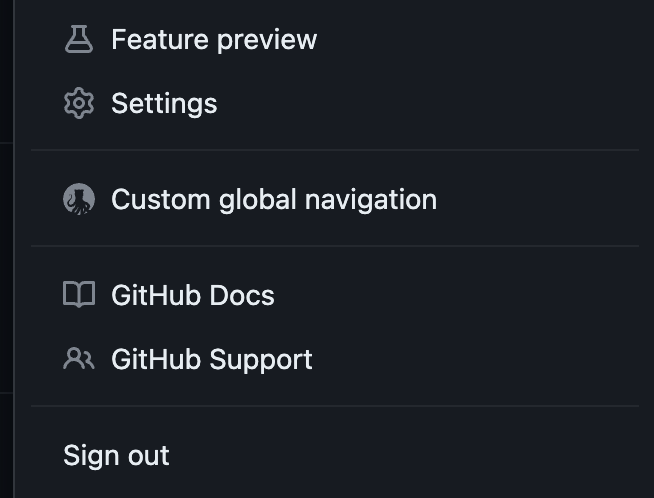

  
  

# GitHub Custom Global Navigation

This is a [userscript](https://openuserjs.org/about/Userscript-Beginners-HOWTO) to customize the global navigation of GitHub.

## Usage

1. Install a userscript manager like [Tampermonkey](https://www.tampermonkey.net), [Violentmonkey](https://violentmonkey.github.io), or [Greasemonkey](https://addons.mozilla.org/en-US/firefox/addon/greasemonkey/)
1. Go to [GreasyFork](https://greasyfork.org/en/scripts/478687-github-custom-global-navigation) or [OpenUserJS](https://openuserjs.org/scripts/blakegearin/GitHub_Custom_Global_Navigation)
1. Click the install button
1. The userscript will open in your userscript manager where you can install it
1. Once installed, click your avatar in the top right to open the sidebar
1. "Customize global navigation" will be listed underneath the regular "Settings" option

    

## Documentation

### Configurations

There are two (2) preset configurations that are actively maintained and supported.

#### Happy Medium

This previews some the best features and aims to deliver a [happy medium](https://dictionary.cambridge.org/dictionary/english/happy-medium) between the old and new styles without compromising on accessibility. It relies more on Github's CSS variables in hopes of adapting to their changes.

#### Old School

This aims to deliver an experience as close to the style  March 2023 as reasonably possible without compromising on accessibility. Where applicable, it uses hardcoded values instead of CSS variables to prevent side effects from GitHub's changes.

**Note:** Marketplace and Explore will be added soon, or you can go custom and have the option to _not_ add those back in.

### Accessability

Accessibility is important. GitHub [agrees](https://accessibility.github.com).

This userscript should not make GitHub less accessible. However, this userscript doesn't go _out of its way_ to improve accessability on existing elements, and elements added try to be consistent with existing ones.

If you have an accessibility concern with the userscript's operations or additions, please create a new issue.

### Responsive Design

GitHub's new design is responsive, hiding and condensing more elements as screen width decreases. There are breakpoints at `1011px` and `768px`.

Because this userscript is highly customizable, it's complex to make every possible variant similarly responsive. However, the default configurations can be regularly tested during development. It's also worth noting userscripts are not popularly run on tablets or phones.

With these considerations in mind, this is the support priority order of screen widths:

1. `1011px` - `1920px` (e.g. laptops)
1. `1920px` and up (e.g. external monitors)
1. `1011px` and below (e.g. tablets, phones)

### Theming

As of the time of writing, GitHub supports four (4) light and an equal number of dark themes.

This userscript does not have first-class support for sub-themes, but can tell light or dark preference either from GitHub (`data-color-mode`) or falling back to browser-level (`data-color-mode`), which typically matches the OS-level.

### Archiving

Part of the challenge of maintaining the Old School configuration is finding enough archival resources to make it accurate. To help maintain this project and in the spirit of aiding future developers, the HTML of the main `header` tag and `repository-container-header` will be archived as breaking changes occur. These elements will also be archived in a post-script state for each supported configuration.

### Maintenance

This was built with long-term maintenance in mind.

- Keeping selectors neatly sorted and in one place
- Minimizing DOM traversal
- Adding unique IDs to relevant HTML elements that don't have good selectors
- Logging errors cleanly

## Background

In April 2023, GitHub released a public beta for a redesigned global navigation and asked for [feedback](https://github.com/orgs/community/discussions/52083).

In October 2023, GitHub initiated a [public rollout](https://github.blog/changelog/2023-10-17-redesigned-navigation-now-available-to-all-users/) and removed the opt-out from [Release preview](https://docs.github.com/en/get-started/using-github/exploring-early-access-releases-with-feature-preview).

## Credit

- Colors, icons, and element properties for theming were collected from a variety of sources
  - [Internet Archive](https://archive.org) ([donate](https://archive.org/donate))
  - [GitHub](https://github.com/)
  - [Gist](https://gist.github.com/)
  - [YouTube](https://www.youtube.com) <a href="https://www.youtube.com/watch?v=ULsLaA__Xe8">[1]</a><a href="https://www.youtube.com/watch?v=v_1iqtOnUMg">[2]</a><a href="https://youtu.be/jG4Vs81kMlc">[3]</a>

  - If you have video sources that show Old School user navigation around the website (or better yet, some HTML), please contribute to [this thread](https://github.com/blakegearin/github-custom-global-navigation/issues/1)

- Menu

  - Dependency: [GM_config](https://github.com/sizzlemctwizzle/GM_config)

- Archiving

  - Formatter: [Web Formatter](https://webformatter.com/html)

- Logo

  - Silhouette: [Mohamed Hassan](https://pixabay.com/vectors/silhouette-octopus-vector-graphic-3313481/)

  - Optimization: [SVGOMG](https://svgomg.net)

Not affiliated with Microsoft Corporation, GitHub, Inc., or any of their affiliations.
